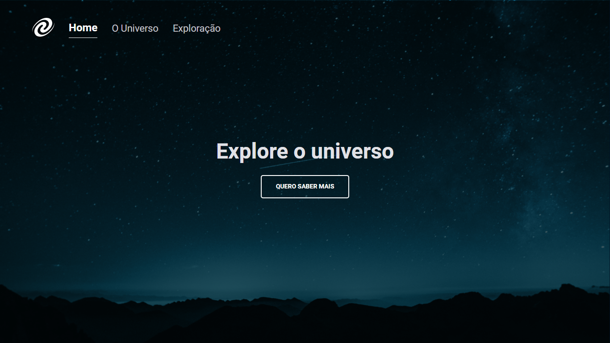

<h1 align="center">
SPA Universe
</h1>

### Sobre

Clique aqui para vizualizar o projeto <a href="https://annygmelo.github.io/focus-timer-desafio-/">link</a>

Desafio "SPA Universe" do Explorer da Rocketseat, cujo objetivo foi a criação de uma página de exploração do universo utilizando o conceito de Single Page Application (SPA)

- Conceitos de SPA;
- Mapeamento de rotas;
- Assíncrono e promises;
- Orientação a objetos;
- Classes e muito mais.

>

## Tecnologias utilizadas

- [ HTML ]
- [ CSS ]
- [ Javascript ]

## Aplicação

O projeto está disponível no <a href=https://www.figma.com/file/3YKqnIuyxebpXDbIFIH5UE/%5BDesafios-Explorer%5D-SPA-Universe-(Copy)?type=design&node-id=104-48&mode=design&t=cJu4pxUFqYIkvA6H-0>figma</a>

  
